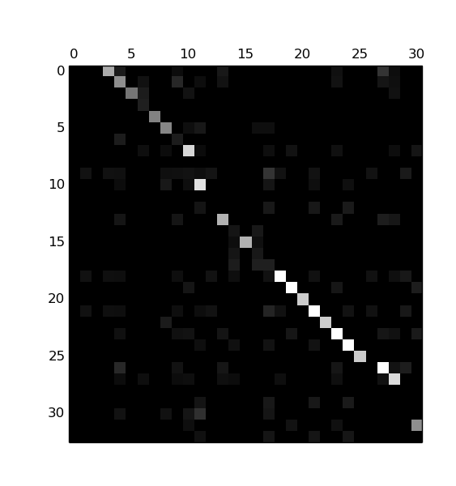

# ROUGE Align
Text Alignment using ROUGE scores.

## Motivation
The point of `rouge_align` is to recognize and align similar sentences. We want to compare sentences that may, or may not be similar (or even exactly the same) given two lists having same or difference length.


## Quickstart
**0) Prerequisites**   

* [`pythonrouge`](https://github.com/pltrdy/pythonrouge)
```shell
git clone https://github.com/pltrdy/pythonrouge
cd pythonrouge
sudo python setup.py install
```

**1) Install**
```shell
git clone https://github.com/pltrdy/rouge_align
cd rouge_align
sudo python setup.py install
```

**2) Run**
```python
rouge_root = "/home/<user>/pythonrouge/pythonrouge/RELEASE-1.5.5"
rouge_path = rouge_root + "ROUGE-1.5.5.pl"
rouge_data = rouge_root + "data"

sentences1 = ["", ...]
sentences2 = ["", ...]

# note that, verbose really verbose
ra = RougeAlign(sentences1, sentences2, rouge_path, rouge_data,  autorun=True, verbose=True)
ra.pretty()
ra.plot_to_file('out.png')
```

**3) Outputs**



The alignment takes various forms:
- `ra.list`: such as `ra.list[i1] = i2` means that `sentences[i1]` is associated with `sentences[i2]`. It is most probably what you want.
- `ra.distance`: `[l1 x l2]` matrix such as `distance[i1][i2] = distance(i1, i2)`. The matrix can be plotted using Matplotlib with `ra.plot()` or `ra.plot_to_file(filename=distances.png)`.
- `ra.align`: `[l1 x l2]` matrix such a `align[i1][i2] = 1` if the `sentences[i1]` is associated with `sentences[i2]`, `0` otherwise. 

